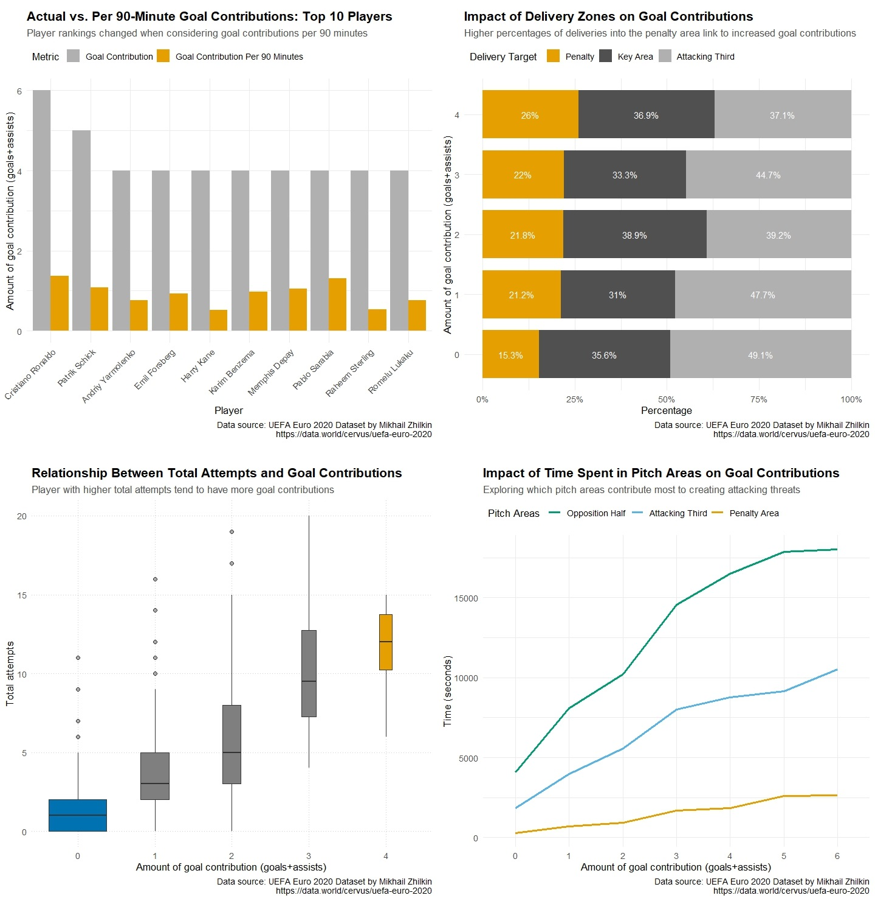

# Measuring Attacking Threats in Football

## Overview

At the highest level of football, small details can shift the outcome of a match. This highlights the importance of using match analysis in developing a better understanding of tactics. In a football match, two teams compete with the objective of putting the ball into the opposing team’s net. The fundamental rule of football is that the team scoring a greater number of goals within 90 minutes wins the match. To score a goal, attacking threats need to be created to exploit weaknesses in the opponent’s defensive formation. In this study, we are looking at various aspects of attacking threats in football because we want to find out the most effective ways of measuring them in order for my audience to understand the key areas for developing tactics in football matches.

## Questions

> [!NOTE]
> What statistics can be used to measure attacking threats to identify key areas for developing tactics in football matches?

## Descriptions & Key Messages

### Visualisation 1

The chart shows the top 10 players with the highest goal contributions. The goals contribution per match was calculated and is represented by the yellow bar. The ranking shift indicates that players who scored more actual goals might achieve this due to having more played time. This concludes that goal contribution per match better reflects a player’s performance, and playing time should be considered when comparing player’s performances.

### Visualisation 2

In terms of pitch areas, we tried to prove that action in penalty area create more winning chances compared to attacking third area. This was done by comparing the proportion of delivery zones to the number of goal contributions. The visualisation shows that only the proportion of balls delivered to the penalty area is associated with number of goal contributions. The result suggests that attacking threats can be measured by number of ball deliveries into penalty area.

### Visualisation 3

This visualisation focuses on the influence of total attempts on goal contributions by categorises number of goal contributions into boxes, illustrating the distribution of number of total attempts. The increasing trend indicates that higher total attempts correlate with greater attacking threats. The simplified metric of total attempts can be considered as a good indicator for measuring attacking threats.

### Visualisation 4

We aimed to identify if there any differences in player’s positioning between player who contributed different number of goals. The visualisation shows nearly the same proportion of time spent in different areas of the pitch regardless of the number of goal contributions. This suggests that time spent in different areas of the pitch have no influence on attacking threats. Therefore, attacking threats cannot be measured by using time spent in specific areas of the pitch.
